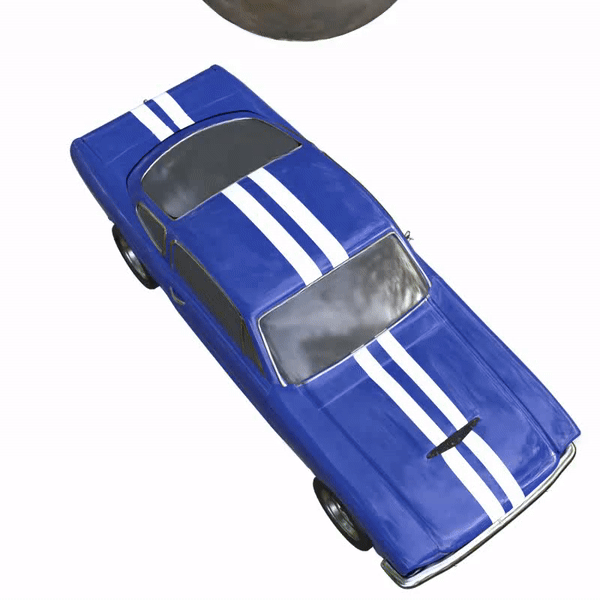
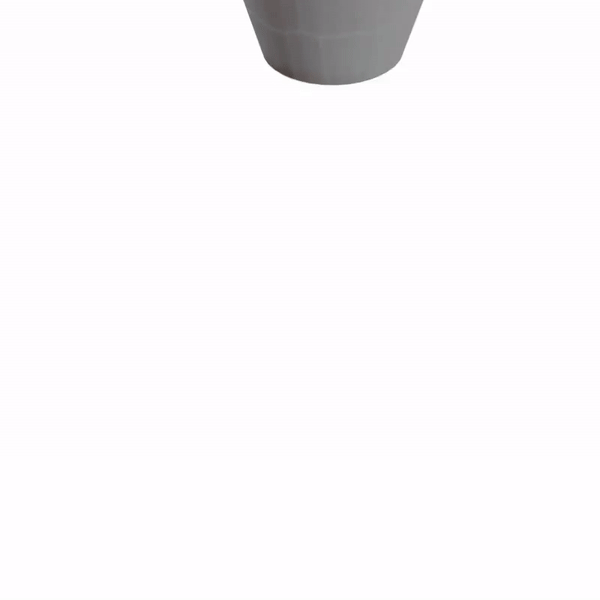

# GASP: Gaussian Splatting for Physics-Based Simulations

   

Physics simulation is paramount for modeling and utilizing 3D scenes in various real-world applications. However, integrating with state-of-the-art 3D scene rendering techniques such as Gaussian Splatting (GS) remains challenging. Existing models use additional meshing mechanisms, including triangle or tetrahedron meshing, marching cubes, or cage meshes. Alternatively, we can modify the physics-grounded Newtonian dynamics to align with 3D Gaussian components. Current models take the first-order approximation of a deformation map, which locally approximates the dynamics by linear transformations. In contrast, our GS for Physics-Based Simulations (GASP) pipeline uses parametrized flat Gaussian distributions.

  Consequently, the problem of modeling Gaussian components using the physics engine is reduced to working with 3D points. In our work, we present additional rules for manipulating Gaussians, demonstrating how to adapt the pipeline to incorporate meshes, control Gaussian sizes during simulations, and enhance simulation efficiency. This is achieved through the Gaussian grouping strategy, which implements hierarchical structuring and enables simulations to be performed exclusively on selected Gaussians. The resulting solution can be integrated into any physics engine that can be treated as a black box. As demonstrated in our studies, the proposed pipeline exhibits superior performance on a diverse range of benchmark datasets designed for 3D object rendering.

 

 

## Installation guide
Our repository builds upon [gaussian-mesh-splatting repository](https://github.com/waczjoan/gaussian-mesh-splatting). We kindly direct you to check requirments in this repository, the environment is the same as theirs.

## How to prepare files for simulation
Train a model using [GaMeS](https://github.com/waczjoan/gaussian-mesh-splatting) with `--gs_type` as `gs_flat`. \
Using trained GaMeS model, run `scripts/create_pseudomesh.py` script from this repository. It will save couple files in the model path under new `pseudomesh_info` folder. `vertices.pt` are necessary for simulation using Taichi and `scale_1.obj` for Blender's and Genesis'. 

If you wish to create hierarchical representation in order to reduce number of Gaussians prior to simulation, then you do not need to run `create_pseudomesh.py` but `scripts/generate_hierarchy.py` which will also generate the same files as `create_pseudomesh.py` as well as necessary files for mapping back sub Gaussians based on simulation on core ones. 

## Simulations using Blender step-by-step
Load obj file into Blender. Then you can perform simulations using pseudomesh. In the paper, we perform this simulations by manually selecting triangles for simulation, putting them into vertex group and then performing lattice deform operations. After performing simulation using Blender, export `.obj` files (i.e. using script from `scripts/blender_sample_script.py` which was made for Blender 4.0).

## Simulations using Taichi elements
We provide the code for Taichi MPM simulations in `taichi_examples/demo` path. If you wish to replicate the results, follow instructions from [Taichi elements github](https://github.com/taichi-dev/taichi_elements). We added new files under `demo` directory in the original repository and run it with following arguments:

`--in-dir` - path to input folder where there is `gs_flat_vertices.pt` file with pseudomesh \
`--out-dir` - path where to save results of the simulation

## Simulations using Genesis
We provide the code for simulations from our work in `genesis_examples/examples/tutorials` path. If you wish to replicate our results, follow instructions from [Genesis github](https://github.com/Genesis-Embodied-AI/Genesis). Additionally, for our simulation we modify a file from Genesis code under `genesis/utils/particle.py`. We attached file after our modifications under `genesis_examples`.
To run the simulation please provide following arguments:

`--model_path` - path to the model directory \
`--obj_path` - path to the pseudomesh in obj format if not provided it will search under `{model_path}/pseudomesh_info/ours_30000/scale_1.obj` \
`--material` - one of the available materials (base, elastic, elastoplastic, liquid, muscle, sand, snow) \
`--save_path` (optional) - path where to save results of the simulation 

## Generating final renders
In order to generate final views, use `scripts/render_simulation.py`. Remember to use `--scale` the same as the one used in `create_pseudomesh.py`. For `--sym_dirname` give a path to `obj` files created during simulation with selected engine. For the `--model_path` use the path for the trained GaMeS model with created pseudomesh files by `create_pseudomesh.py`. If you wish to render multiple Gaussian models in the same simulation, use `scripts/render_multiple_gaussians.py` instead.

<section class="section" id="BibTeX">
  

    <h2 class="title">Citations</h2>
If you find our work useful, please consider citing:
<h3 class="title">GASP: Gaussian Splatting for Physic-Based Simulations

</h3>
    <pre><code>@Article{2024gasp,
      author={Piotr Borycki and Weronika Smolak and Joanna Waczyńska and Marcin Mazur and Sławomir Tadeja and Przemysław Spurek},
      title={GASP: Gaussian Splatting for Physic-Based Simulations},
      year={2024},
      eprint={2409.05819},
      archivePrefix={arXiv},
      primaryClass={cs.CV},
      url={https://arxiv.org/abs/2409.05819}, 
}
</code></pre>

</section>