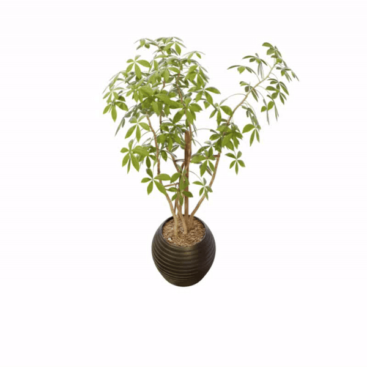
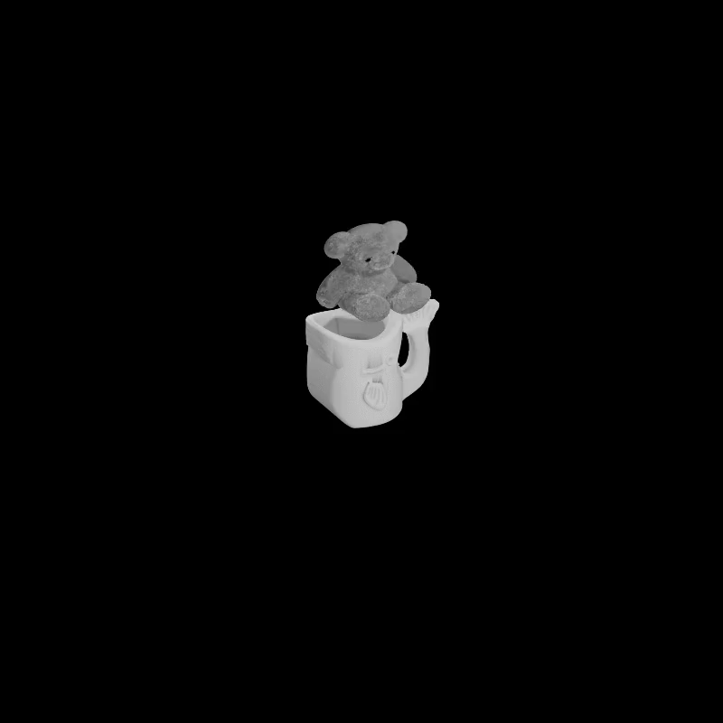
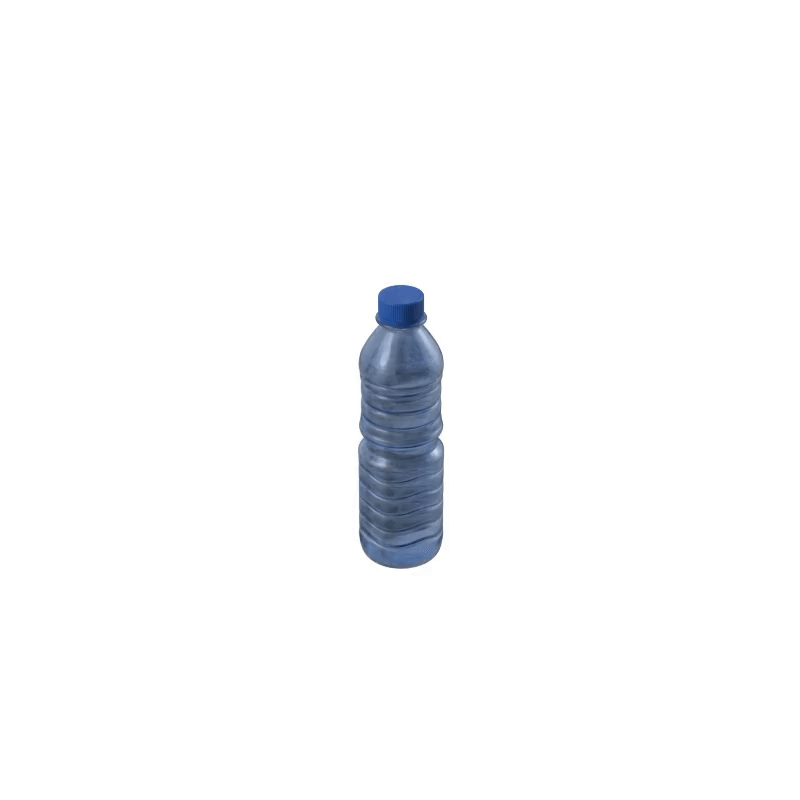

# GASP: Gaussian Splatting for Physics-Based Simulations

[](https://arxiv.org/abs/2409.05819)  [](https://waczjoan.github.io/GASP/) [](https://github.com/waczjoan/GASP)


Physics simulation is paramount for modeling and utilizing 3D scenes in various real-world applications. However, integrating with state-of-the-art 3D scene rendering techniques such as Gaussian Splatting (GS) remains challenging. Existing models use additional meshing mechanisms, including triangle or tetrahedron meshing, marching cubes, or cage meshes. Alternatively, we can modify the physics-grounded Newtonian dynamics to align with 3D Gaussian components. Current models take the first-order approximation of a deformation map, which locally approximates the dynamics by linear transformations. In contrast, our GS for Physics-Based Simulations (GASP) pipeline uses parametrized flat Gaussian distributions.

  Consequently, the problem of modeling Gaussian components using the physics engine is reduced to working with 3D points. In our work, we present additional rules for manipulating Gaussians, demonstrating how to adapt the pipeline to incorporate meshes, control Gaussian sizes during simulations, and enhance simulation efficiency. This is achieved through the Gaussian grouping strategy, which implements hierarchical structuring and enables simulations to be performed exclusively on selected Gaussians. The resulting solution can be integrated into any physics engine that can be treated as a black box. As demonstrated in our studies, the proposed pipeline exhibits superior performance on a diverse range of benchmark datasets designed for 3D object rendering.


</br>

</br>


## Installation guide
Our repository builds upon [gaussian-mesh-splatting repository](https://github.com/waczjoan/gaussian-mesh-splatting). We kindly direct you to check requirments in this repository, the environment is the same as theirs.

## How to prepare files for simulation
Train a model using [GaMeS](https://github.com/waczjoan/gaussian-mesh-splatting) with `--gs_type` as `gs_flat`. \
Using trained GaMeS model, run `scripts/create_pseudomesh.py` script from this repository.
```shell
python scripts/create_pseudomesh --model_path path/to/games/model --scale 1
``` 
It will save couple files in the model path under new `pseudomesh_info` folder. `vertices.pt` are necessary for simulation using Taichi and `scale_1.obj` for Blender's and Genesis'. Arguments scale let's you decide how pseudomesh should be rescaled. Bigger scale may be necessary to avoid numerical errors when performing simulations in Blender.

If you wish to create hierarchical representation in order to reduce number of Gaussians prior to simulation, then you do not need to run `create_pseudomesh.py` but `scripts/generate_hierarchy.py` which will also generate the same files as `create_pseudomesh.py` as well as necessary files for mapping back sub Gaussians based on simulation on core ones. 

```shell
python scripts/generate_hierarchy.py --model_path path/to/games/model --scale 1 --threshold 0.1
```
The threshold parameter controls threshold used for calculating Birch clustering. Scale works analogically like in `create_pseudomesh.py`.

## Simulations using Blender 
Load obj file into Blender. Then you can perform simulations using pseudomesh. In the paper, we perform this simulations by manually selecting triangles for simulation, putting them into vertex group and then performing lattice deform operations. After performing simulation using Blender, export `.obj` files (i.e. using script from `scripts/blender_sample_script.py` which was made for Blender 4.0+).

If you are interested, you can find exemplary simulation with input files and blend file on [google drive](https://drive.google.com/drive/folders/1k6KUgbaZ9mVBIWN69B1BjIAcZhTtR4ST?usp=sharing) for following ficus simulation:
</br>

</br>

## Simulations using Taichi elements
We provide the code for Taichi MPM simulations in `taichi_examples/demo` path. If you wish to replicate the results, follow instructions from [Taichi elements github](https://github.com/taichi-dev/taichi_elements) and download taichi_elements:

```shell
pip install git+https://github.com/taichi-dev/taichi_elements
```

We added new files under `demo` directory in the original repository and run it with following arguments:

`--in-dir` - path to input folder where there is `vertices.pt` file with pseudomesh \
`--out-dir` - path where to save results of the simulation

If you are interested, you can find exemplary simulation with input files and blend file on [google drive](https://drive.google.com/drive/folders/1k6KUgbaZ9mVBIWN69B1BjIAcZhTtR4ST?usp=sharing) for following teddybear and fish cup simulation:
<br>

</br>

To create this exemplary simulation run:
```shell
 python taichi_examples/demo/cup_carpet.py --in-dir output/teddybear/gs_flat/pseudomesh_info/ours_30000/ output/fish_cup/gs_flat/pseudomesh_info/ours_30000/ --scales 0.4 0.4 0.4 0.5 0.5 0.5 --offsets 0.30 0.5 0.30 0.25 0.0 0.25 --out-dir output/taichi_teddybear output/taichi_cup
```
or you can use already created bash script in `taichi_examples/sample.sh`
## Simulations using Genesis
We provide the code for simulations from our work in `genesis_examples` path. If you wish to replicate our results, firstly clone [Genesis github](https://github.com/Genesis-Embodied-AI/Genesis):
```shell
git clone https://github.com/Genesis-Embodied-AI/Genesis
cd Genesis
git checkout 0a199c194f2580d92c4fa0bae3771038d2298c3f
```
Then apply our changes:
```shell
cd ..
cp genesis_examples/genesis_gasp.patch Genesis
cd Genesis
git apply genesis_gasp.patch
pip install .
```
Then, you should have a file `examples/tutorials/bottle.py` which was used to create below simulation:
<br>

</br>

If you are interested, you can find input files on [google drive](https://drive.google.com/drive/folders/1k6KUgbaZ9mVBIWN69B1BjIAcZhTtR4ST?usp=sharing). After putting file from Genesis/trained_model from google drive into `output` directory in Genesis folder, you should be able to run the simulation as such:
```shell
python examples/tutorials/bottle.py
```
which will create simulation files (pt necessary to generate final renders, see Generating final renders section) under directiory `output/bottle/genesis_triangles/elastic`.


## Generating final renders
In order to generate final views from physical engine, use `scripts/render_simulation.py`. Remember to use `--scale` the same as the one used in `create_pseudomesh.py`. For `--sim_dirname` give a path to `obj` files created during simulation with selected engine. For the `--model_path` use the path for the trained GaMeS model with created pseudomesh files by `create_pseudomesh.py`. If you wish to render multiple Gaussian models in the same simulation, use `scripts/render_multiple_gaussians.py` instead.
```shell
python scripts/render_simulation.py --model_path path/to/games/model --sim_dirname path/to/objs --scale 1
```

### Example for obj files
```shell
python scripts/render_simulation.py --model_path output/ficus --sim_dirname simulations/ficus --scale 1
```

### Example for pt files and multiple files
Using example from cup_fish simulation from Taichi:
```shell
 python render_multiple_gaussians.py --model_paths output/teddybear/gs_flat/ output/fish_cup/gs_flat/ --sym_dirname output/taichi_teddybear/ output/taichi_cup/ 
```

<section class="section" id="BibTeX">
  <div class="container is-max-desktop content">
    <h2 class="title">Citations</h2>
If you find our work useful, please consider citing:
<h3 class="title">GASP: Gaussian Splatting for Physic-Based Simulations

</h3>
    <pre><code>@Article{2024gasp,
      author={Piotr Borycki and Weronika Smolak and Joanna Waczyńska and Marcin Mazur and Sławomir Tadeja and Przemysław Spurek},
      title={GASP: Gaussian Splatting for Physic-Based Simulations},
      year={2024},
      eprint={2409.05819},
      archivePrefix={arXiv},
      primaryClass={cs.CV},
      url={https://arxiv.org/abs/2409.05819}, 
}
</code></pre>

</div>

</section>